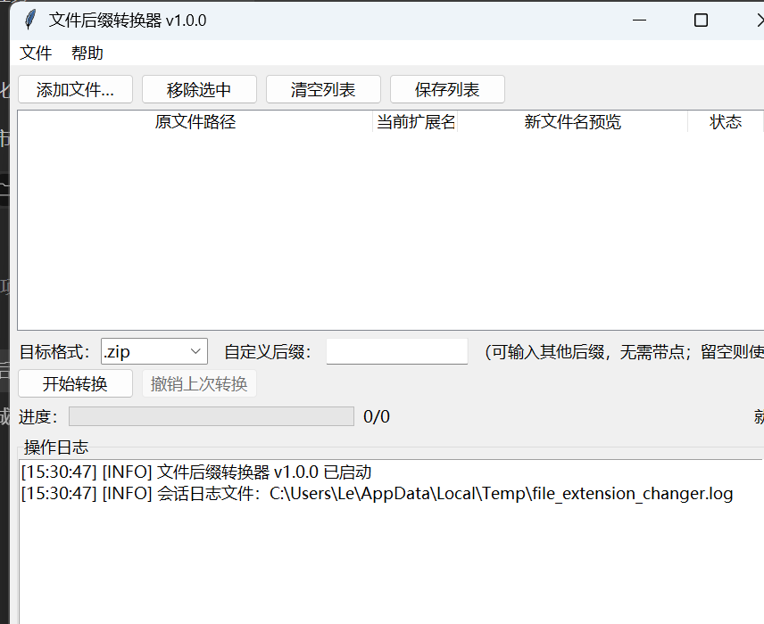

# File Extension Changer（文件后缀转换器）🔄

[English](README_EN.md) | [中文](README.md)

[](LICENSE)
[](https://www.python.org/)
[]()
[](https://github.com/XLDD-SL/file-extension-changer/stargazers)

## 📖 项目简介

想必大家在下载网盘“资源”的时候解压后文件要手动将.png等格式的文件修改为.zip等格式的压缩包，作为专业的”游戏“”爱好者，这实在是太麻烦了！！！于是：
一个**零依赖、开箱即用**的本地批量改后缀小工具：把图片（`.jpg` / `.jpeg` / `.png`）或其他任意文件的扩展名批量改为 `.zip` / `.7z` 或自定义后缀，并可一键撤销。诞生了！

> 核心原则：**只修改文件名，绝不读取、不转换、不压缩文件内容**。
> 全程仅执行文件系统重命名（`os.rename`，同目录纯元数据操作），文件数据一个字节都不会变。

## ✨ 核心特性

- 🔄 **批量转换** — 多选文件一键改后缀，主文件名保持不变：`photo.jpg → photo.zip`
- 🛡️ **绝不覆盖** — 目标文件名冲突时自动追加序号（`photo_1.zip`、`photo_2.zip`...），任何情况下不覆盖已有文件
- ↩️ **一键撤销** — 记录每次转换批次，可逐批恢复原始扩展名；部分失败时可重试
- ✏️ **自定义后缀** — 预置 `.zip` / `.7z` 下拉选项，也支持任意自定义后缀（如 `tar.gz`），自动校验非法字符
- 📊 **实时反馈** — 进度条 + 状态文字 + 带时间戳的操作日志（成功/跳过/失败及原因）
- 🧵 **界面不卡顿** — 重命名在后台线程执行，UI 经消息队列刷新（Tkinter 线程安全模型）
- 📋 **清单导出** — 一键保存当前文件列表为文本文件，便于核对
- 🖥️ **跨平台** — Windows / Linux 均可直接运行，无需安装任何第三方库
- 🈶 **全中文界面** — 图形界面与文档均为中文，附带内置使用说明

## 🖼️ 界面预览



## 🚀 快速开始

无需安装，克隆或直接下载 [`file_extension_changer.py`](file_extension_changer.py) 即可运行。

### Windows

**方式一：一键创建桌面快捷方式（推荐）**

下载本仓库（`Code → Download ZIP` 解压，或 `git clone`），进入目录后**双击 `创建桌面快捷方式.bat`**，桌面即出现「文件后缀转换器」图标，以后双击图标即可打开工具（无命令行黑窗口）。

**方式二：命令行运行**

```bash
# Python 3.8+ 官方安装包自带 tkinter，直接运行
python file_extension_changer.py
```

### Linux

```bash
# 主流发行版需先安装 tkinter
sudo apt install python3-tk            # Debian / Ubuntu
sudo dnf install python3-tkinter       # Fedora

python3 file_extension_changer.py
```

## 📦 使用指南

1. 点击 **「添加文件」** 选择一个或多个文件（默认筛选图片格式，可切换为“所有文件”）
2. 在 **「目标格式」** 选择 `.zip` / `.7z`，或在 **「自定义后缀」** 输入其他后缀（无需带点）
3. 确认列表中 **「新文件名预览」** 无误后，点击 **「开始转换」**，并在安全确认框中点击“是”
4. 转换完成后，点击 **「撤销上次转换」** 可将本批次文件恢复为原始扩展名（可多次点击，逐批回退）

### 冲突规则

| 情况 | 行为 |
|---|---|
| 目标文件名已存在 | 自动追加序号：`photo_1.zip`、`photo_2.zip` ... |
| 文件已是目标后缀 | 跳过不处理，并在日志中说明 |
| 文件不存在 / 被占用 / 权限不足 | 标记失败并记录原因，不影响其余文件 |

## ⚠️ 安全说明

- 本工具只修改文件名，**不读取、不修改文件内容**
- 修改扩展名不会破坏文件数据，但可能导致文件无法被原始程序直接打开（改回后缀即可恢复）
- 每次转换前都有明确的确认提示；撤销记录仅保存在本次会话内存中

## 🛠️ 技术实现

| 模块 | 说明 |
|---|---|
| 图形界面 | Python 标准库 `tkinter` / `ttk`，零第三方依赖 |
| 重命名 | `pathlib` + `os.rename`（同目录纯元数据操作），刻意避开 `shutil.move`（跨磁盘会退化为复制+删除） |
| 防覆盖 | `os.path.exists` 存在性探测 + 序号递增（Linux 上 `os.rename` 会静默覆盖，因此冲突预检查是安全防线） |
| 并发模型 | 重命名在工作线程执行，所有 UI 更新经 `queue.Queue` + `after()` 回主线程（Tkinter 非线程安全） |
| 日志 | `logging` 双通道：界面日志区（自定义 QueueHandler）+ 系统临时目录会话日志文件 |

更多设计细节见 [docs/PRD-文件后缀转换器.md](docs/PRD-文件后缀转换器.md)（含完整的异常处理矩阵与验收清单）。

## ❓ 常见问题

<details>
<summary><b>修改后缀会损坏文件吗？</b></summary>

不会。扩展名只是文件名的组成部分，与文件内容完全独立。本工具只执行重命名操作，文件数据不变；改回原后缀即可恢复原样。
</details>

<details>
<summary><b>为什么拖拽文件到窗口没有反应？</b></summary>

Python 标准库不支持操作系统级的文件拖放（需要第三方库 tkinterdnd2）。为保证零依赖开箱即用，本项目采用“添加文件”按钮替代，见 <a href="#-开发路线">开发路线</a>。
</details>

<details>
<summary><b>Linux 上启动报 ImportError: No module named 'tkinter'？</b></summary>

需要安装 tkinter：Debian/Ubuntu 执行 `sudo apt install python3-tk`，Fedora 执行 `sudo dnf install python3-tkinter`。
</details>

<details>
<summary><b>转换后的文件打不开了怎么办？</b></summary>

这是修改后缀的预期效果（例如图片查看器不认识 `.zip` 后缀）。点击「撤销上次转换」即可恢复原始扩展名。
</details>

## 🗺️ 开发路线

- [x] 批量重命名 + 冲突自动序号
- [x] 批次撤销（含部分失败重试）
- [x] 自定义后缀校验
- [x] 双通道日志（界面 + 文件）
- [x] 文件清单导出
- [ ] 拖拽支持（计划通过可选依赖 tkinterdnd2 实现，检测到则启用，否则回退按钮模式）
- [ ] 递归文件夹批量改名
- [ ] 撤销记录持久化（跨会话恢复）

## 🤝 参与贡献

欢迎提交 Issue 与 Pull Request！

1. Fork 本仓库并创建你的分支（`git checkout -b feature/awesome`）
2. 提交更改（`git commit -m "feat: add awesome"`）
3. 推送到分支（`git push origin feature/awesome`）
4. 发起 Pull Request

## 📄 开源协议

本项目基于 [MIT License](LICENSE) 开源。

**简单来说**：你可以自由使用、修改、分发本项目（包括商用），只需保留原始版权声明，作者不对使用产生的任何问题承担责任。

---

如果这个项目对你有帮助，欢迎点一个 ⭐ Star 支持一下！
